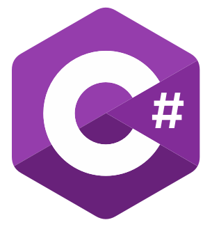
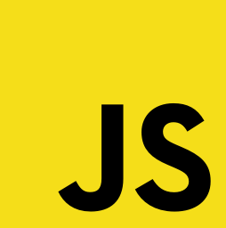
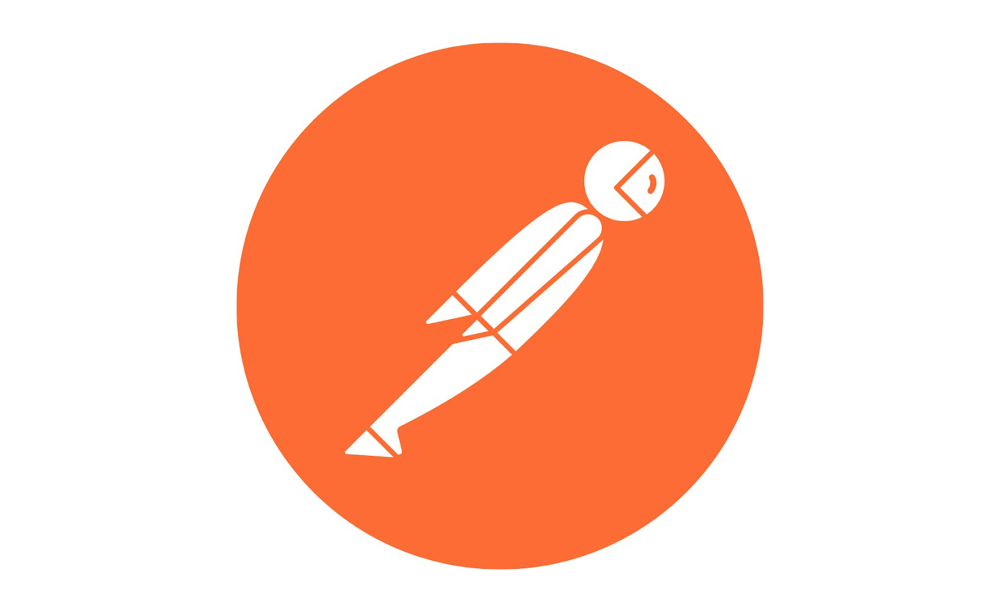

# Hi there 👋 I'm Jasdeep. I  solve real-world problems through my passion for software. 

<!--
**JasdeepB/JasdeepB** is a ✨ _special_ ✨ repository because its `README.md` (this file) appears on your GitHub profile.

Here are some ideas to get you started:

- 🔭 I’m currently working on ...
- 🌱 I’m currently learning ...
- 👯 I’m looking to collaborate on ...
- 🤔 I’m looking for help with ...
- 💬 Ask me about ...
- 📫 How to reach me: ...
- 😄 Pronouns: ...
- ⚡ Fun fact: ...
-->
## 🎓 I'm a recent Computer Science & Software Engineering graduate from the University of Washington.

## Many of my public facing project repositories are not shown, please request access

### During these last couple of months of remote work and lockdowns I've been...
<ul>
  <li>Working on projects that I'm interested in</li>
  <li>Using the internet as my mentor</li>
  <li>Learning JavaScript in order to create <a href="https://www.rapidstockchecker.com/">Rapid Stock Checker</a></li>
  </ul>

## 🧰 Languages, Tools, and Frameworks I can't get seem to get enough of

